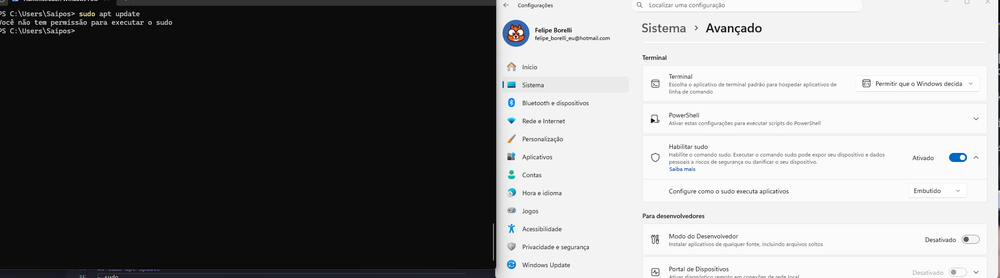

# Como usar o terminal com a tribuição instalada e Abrir o contener no VSCode 
[Texto do link](https://youtu.be/6FW3L-NePUI?si=Vpp8XagXsicnDX7d&t=349)

# Como executar Sofwares com interface gráfica diretamente pela barra do Windows
[Texto do link](https://youtu.be/6FW3L-NePUI?si=qr0FJaAOnUr-Q-3G&t=402)

<!--
Pelo que pesquisei para fazer isso precisa ser instalado o Ubuntu Desktop e Rufus, confirmar se é isso pois o Ubuntu Desktop é bem pesado.

Conseguir resolver 
vv

# Desvendando o WSL 2 no Windows 11
- processo de instalação não compativel, conferir.

# sudo apt update
-  - removi pois consegui resolver
- mesmo habilitado o comando está com erro.
-->
